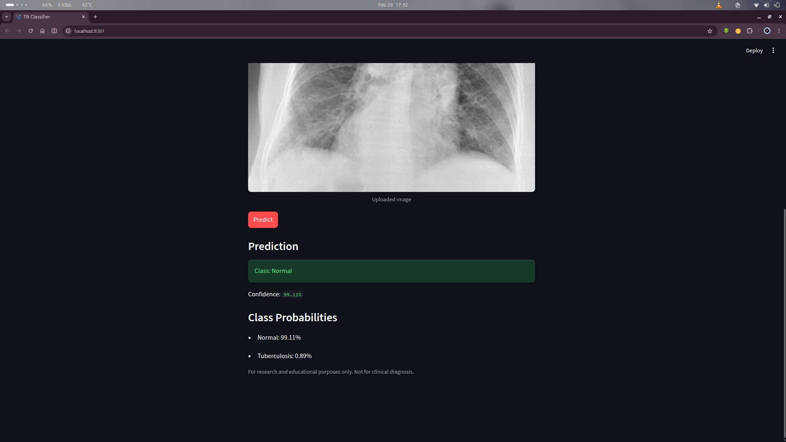

# Tuberculosis Chest X-ray Classifier

A portfolio-ready deep learning project for binary classification of chest X-rays into:

- `Normal`
- `Tuberculosis`

The repository converts notebook experimentation into a clean, reusable training and inference pipeline with a Streamlit UI.

## Project Overview

This project includes:

- modular preprocessing shared by training and inference
- a reproducible TensorFlow training script
- saved model artifacts for deployment
- a Streamlit application for interactive predictions

## Dataset Description

The notebook pipeline was built for the Kaggle dataset:

- **Tuberculosis (TB) Chest X-ray Dataset** by tawsifurrahman
- expected folder structure under data root:

```text
data/
├── Normal/
└── Tuberculosis/
```

If your dataset is elsewhere, pass `--data-dir` to the training script.

## Model Used

A custom CNN implemented in TensorFlow/Keras:

- 3 convolution blocks (`Conv2D + MaxPooling2D`)
- `GlobalAveragePooling2D`
- dense classifier with dropout
- output layer with softmax for 2 classes

## Project Structure

```text
ml-project/
├── notebooks/
│   └── model.ipynb
├── data/
├── models/
│   └── model.joblib
├── src/
│   ├── config.py
│   ├── preprocessing.py
│   ├── train.py
│   └── predict.py
├── app/
│   └── streamlit_app.py
├── requirements.txt
├── README.md
└── .gitignore
```

## Screenshots

### Streamlit App Home


### Prediction Result View


### Additional Project Screenshot


## How To Run Locally

1. Install dependencies:

```bash
pip install -r requirements.txt
```

2. Prepare dataset in `data/` (or use `--data-dir` to point to your dataset root).

3. Train model and save artifacts:

```bash
python -m src.train --data-dir data
```

4. Run Streamlit app:

```bash
streamlit run app/streamlit_app.py
```

## Example Usage

Programmatic inference (after training):

```python
from src.predict import predict_from_image_path

result = predict_from_image_path("path/to/chest_xray.png", artifact_path="models/model.joblib")
print(result)
```

CLI training example with custom epochs:

```bash
python -m src.train --data-dir data --epochs 25
```

## Notes

- This project is for educational/research use.
- It is not a medical diagnostic tool.
